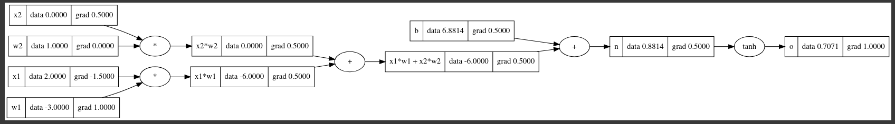

# micrograd_cpp
A C++ implementation of
[karpathy/micrograd](https://github.com/karpathy/micrograd) (only the engine part).

Half of the first episode of *Neural Nets: Zero to Hero*:
[The spelled-out intro to neural networks and backpropagation: building micrograd](https://youtu.be/VMj-3S1tku0)
is included.


### Building

Build with CMake, eg

```bash
$ cmake .
$ make
```

### Example usage

The main.cpp includes an example usage of the engine. The example equation that is in the Karparhy's video is implemented here. The result can be seen in terminal but the example visualised equation in the main.cpp file is below. 


TODO: Visualizing will be added.
